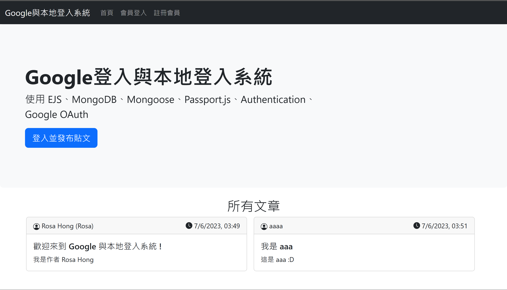

# Passport.js Google OAuth Login + Local SignUp  & Login Practice  

這是一個只有 **後端** 的專案練習，沒有使用任何前端框架，部屬在 render.com 上。    
實作 Passport.js + Passport Google OAuth 2.0 與本地註冊與登入。

## 畫面

首頁  
  
本地註冊成功後導向登入頁  
  
登入後進到個人頁面  
  
Google 用戶登入驗證  
  
Google 驗證後個人頁  
  

## 功能

[Live Demo](https://googleoauthpractice.onrender.com)

測試帳號密碼
```plain-text
test@gmail.com
testpassword
```
本地註冊的 email 只要符合格式都可以輸入

- [X] 在首頁看見所有登入過用戶發表過的文章
- [X] 使用者可以用 Google 登入
- [X] 本地註冊 / 登入
- [X] 登入的使用者能夠在個人頁面能看到自己所有發表過的文章
- [X] 登入的使用者能夠 發表貼文
- [X] 登入的使用者能夠 編輯文章
- [X] 登入的使用者能夠 刪除文章

> 註冊時請不要輸入使用真實訊息
> google 登入會記住最基本的 profile 資訊，並沒有其他權限

## 安裝

本專案開發環境
- Node : v16.15.0 (或以上)
- MongoDB : v6.0.6
- Mongosh : v1.9.1

> 本地開發請先建立自己的 mongoDB database 

建立一個範例資料庫，進到 mongoDB shell-mongosh  之後
```sh
use exampleDB;
```

開發前必須先到 [google 開發者平台](https://console.cloud.google.com/) 註冊 **網頁應用程式** 的 OAuth 憑證，取得 **client_id** 與 **secret**

### 取得專案

```bash
git clone git@github.com:meitung473/GoogleOAuthPractice.git
```

### 安裝套件

```bash
npm install
```

### 運行專案

本專案使用 nodemon，當檔案變更儲存後會自動重新啟動伺服器

> 儲存後都會重啟伺服器，如同每次手動重新輸入 `node index.js`，如果是操作登入後的操作要重新登入

本地開發使用
```bash
npm run dev
```

部屬使用
```bash
npm start
```

### 開啟專案

本地開發在瀏覽器網址列輸入以下即可看到畫面

```plain-text
http://localhost:8080/
```

預設 port 是 8080 ，如果要更改 port 到 [環境變數說明](#環境變數說明) 段落修改內容

## 環境變數說明

複製 `example.env` 檔案一份並且修改檔名為 `.env` 使用

本地開發是使用 `.env.local`
```bash
cp .env.example .env.local
```

.env 內容說明

```ini
BASE_URL = # 起始路由 預設是 http://localhost:8080
PORT = # 開啟 server 的 port。預設 8080
MONOGODB_CONNECT_URL= # MongoDB 資料庫的位址
GOOGLE_CLIENT_ID = # 到 Google 申請 application 的 client ID
GOOGLE_CLIENT_SECRET= # 到 Google 申請 application 的 secret
SESSION_SECRET= # express-session 設定 session 內容，驗證會使用到 session，設定 secret
BCRYPT_SALTROUND = # 本地註冊使用 bcrypt 將密碼雜湊儲存進 database，設定 salt round
```

## 資料夾說明

- config : 啟動伺服器執行全域的程式碼。(eg. 區分開發環境與部屬環境設定,passport 驗證)
- db : 資料庫連結相關
- utils : 共用的 functions
- models : 定義 document 的 schema
- routes : 使用到的路由
- views : 渲染 ejs template

## 專案技術

> 本專案不包含前端

- bcrypt 將使用者註冊的密碼經過雜湊，在資料庫不存明文密碼
- connect-flash 顯示錯誤或是操作訊息
- dotenv 存放專案私密內容
- ejs 渲染模板
- express 架設 http 伺服器以及路由
- express-session 在使用者登入時建立 cookie-based session ，記住登入驗證狀態
- mongoose mongoDB ODM，在 node.js 環境下透過 mongoose 操作 mongoDB database
- passport 驗證插件
- passport-google-oauth20 passport google OAuth 相關套件
- passport-local passport 本地登入驗證相關套件
- bootstrap 美化 ejs 模板
- connect-mongo 登入驗證時會建立 cookie-based session，要修正儲存進去的 database
- nodemon 儲存後自動會重啟伺服器
- cross-env 設定 npm script 區分開發與部屬環境

## 第三方服務

- Google OAuth 2.0 : 使用 Google 為第三方登入口，網站除了本地登入外也可以選擇使用者從 google 已登入的帳號進入
